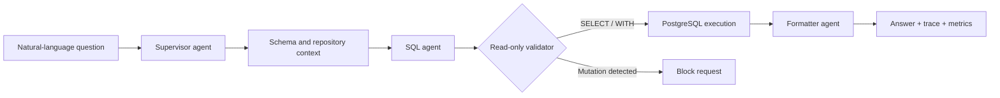

# Multi-Agent Control Platform

Local-first developer tooling for turning natural-language questions into validated PostgreSQL queries while exposing the complete multi-agent execution trace.

[](https://www.npmjs.com/package/melcp)
[](LICENSE)

[Live recruiter demo](https://multi-agent-control-platform-demo.vercel.app/) · [npm package](https://www.npmjs.com/package/melcp)

## Why it exists

Most internal dashboards answer only the questions anticipated when they were built. `melcp` provides an inspectable alternative: a supervisor routes each request through schema selection, SQL generation, read-only validation, execution, and result formatting. Every stage is visible in the React observability console.



## Highlights

- Supervisor-led multi-agent routing with LangChain and NestJS.
- PostgreSQL schema introspection and repository-aware context.
- A `QueryValidator` that rejects destructive or non-read-only SQL.
- Provider abstraction for Gemini and Groq.
- Observable reasoning, token usage, latency, logs, generated SQL, and execution history.
- Browser-based recruiter demo with deterministic data and zero external writes.

## Install the CLI

Requirements: Node.js 18+, a PostgreSQL database, and a dedicated read-only database user.

```bash
npx melcp init
# Edit melcp.config.json with a read-only database URL, repository path, and AI provider key.
npx melcp start
```

The service binds to `127.0.0.1` by default. Do not commit `melcp.config.json`; it contains local credentials.

## Local development

```bash
npm ci
npm --prefix mcp-server ci
npm --prefix react-client ci
npm run build
```

Run the backend and UI independently while developing:

```bash
npm --prefix mcp-server run start:dev
npm --prefix react-client run dev
```

To run the public-safe interface without a backend:

```bash
cd react-client
VITE_DEMO_MODE=true npm run dev
```

On PowerShell, set `$env:VITE_DEMO_MODE="true"` before starting Vite.

## Repository layout

- `mcp-server/` — NestJS agents, orchestration, validation, persistence, and observability.
- `react-client/` — React/Vite control console and frontend-only recruiter demo.
- `melcp.config.example.json` — sanitized CLI configuration contract.

## Safety boundaries

- Use a PostgreSQL role that has only the minimum read permissions.
- The SQL validator is defense in depth, not a substitute for database authorization.
- The hosted demo is simulated and never connects to a database, AI provider, or filesystem.
- Keep API keys and database URLs in the local untracked configuration file.

## License

MIT © 2026 Melvin M Shajan.
